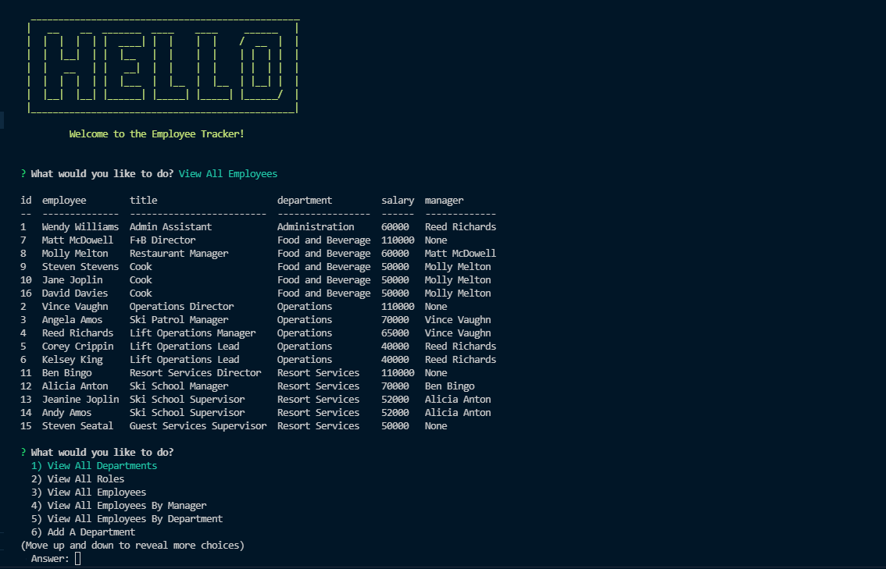

# Employee Tracker

## Description
This app functions entirely within the command line as an interface to create, read, update and delete records in a SQL database. The records are representative of employees of a fictional ski resort company with data about their department, role, salary and manager. The app is written entirely in JavaScript using Node.js, Inquirer and MySQL2 as frameworks. The app is deployed using Node.js. 

<strong>Table of Contents</strong>

- [Installation](#installation)
- [Usage](#usage)
- [License](#license)
- [Contributing Guidelines](#contributing-guidelines)
- [Tests](#tests)
- [Languages, Skills and Credits](#languages-skills-and-credits)
- [Screenshot and Walkthrough](#screenshot-and-walkthrough)
- [Details and Learnings](#details-and-learnings)
- [Questions and Links](#questions-and-links)

## Installation
- Clone the repo.
- Navigate to the folder and run `npm init` followed by `npm install` in order to install the dependencies.
- Be sure to add your MySQL username and password to the .env file and rename to .env.
- Using your preferred CLI to execute MySQL, run first the schema.sql and then the seeds.sql files in the ./db folder in order to create and populate the database.

## Usage
The application can be run by navigating to the root directory and typing `node index.js` into your terminal. The prompts will appear there.

## License
Distributed under the **MIT** license.

## Contributing Guidelines
Contributions help our open source community to continue to evolve, and any contributions are greatly appreciated. If you have a suggestion that would improve this code please follow the directions below. I require that any and all changes adhere to the Code of Conduct outlined in the [Contributor Covenant](https://www.contributor-covenant.org/).

 - Fork the repo
 - Create your feature branch
 - Commit your changes
 - Push the branch and open a pull request

> _**Note:** Any contributions are understood to be under the same MIT that covers the project. If this is a concern please contact me._

## Tests
There are currently no tests written for this application.

## Languages, Skills and Credits
- JavaScript
- SQL
- Node.js
- [inquirer](https://www.npmjs.com/package/inquirer) module for collecting user input
- [mysql2](https://www.npmjs.com/package/mysql2) for executing SQL code
- [dotenv](https://www.npmjs.com/package/dotenv) used to host credentials in an environment file 
- [console.table](https://www.npmjs.com/package/console.table) to display SQL results in the CLI in a more readable format

## Screenshot and Walkthrough
Here are links to Tutorial Videos that show the application in action

- [Video 1 - Intro and View Data Functionality](https://drive.google.com/file/d/1TTz72WN_GD1cmgLi7CvEI-6amkMPFmEA/view?usp=sharing).
- [Video 2 - Add/Update Functionality](https://drive.google.com/file/d/1VldqnmREuPi0H0bMwhh1SQqp10pLbXkT/view?usp=sharing).
- [Video 3 - Delete Functionality](https://drive.google.com/file/d/1e1dFwIxMccI0sJLgLY2627qD3E01NyTf/view?usp=sharing).

Here is an example screenshot of a page generated by the application.

## Details and Learnings
- I chose to use MySQL and raw SQL queries for this project. Leveraging a module like Sequelize could have helped to allow for the code to be more concise.
- JOINs and aliases became important to ensure that the data was readable and useable within the UX confines of the command line
- When query parameters were generated dynamically by the user input it was important to call those outside the query and reference with a ? to help prevent SQL injections.
- I am unaware of a way to 'go backwards' in inquirer if the user changes their mind after selecting an option. The application can be restarted, but for this reason I felt it was useful to include 'Cancel' options for at least the more impactful Delete options.
- I would have liked to have hosted by js code within separate files for a cleaner file structure. The loops and callbacks between the functions and the prompts made this challenging. 

## Questions and Links
Please reach out with any questions regarding the application.

The repository in GitHub is [here](https://github.com/benfok/employee-tracker)

